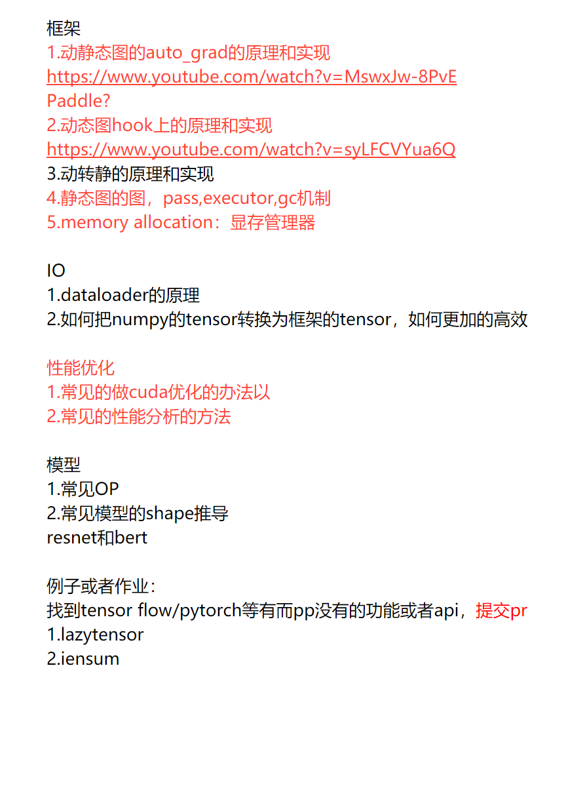

1、用自己的语音描述一下Transformer的意思。 
2、mask的作用 
3、一个bert训练模型需要那些参数，其计算量就可以固定？这些参数都是什么？意义是什么？ 
4、bert是双向的，而gpt是单向的为什么？ 
自注意力层在编码某个词的时候就会考虑这个词所在句子的所有词，所以在编码的时候，self-attention是bidirectional的。 
在解码器中，self-attention只允许处理输出序列中更靠前的那些位置，把后面的位置隐去。就是相当于只处理这个词之前的词，所以，在解码器中的self-attention是unidirectional的。 
5、bert如何做decoder？ 
6、推导一下bert的shape 
7、bert训练如何行列式化 
8、如何prof bert的训练性能。 
.....

第一阶段：入门，目标是了解深度学习+了解paddle架构+cuda性能调优
1.基础知识，了解整体面貌:1~2星期
https://hit-scir.gitbooks.io/neural-networks-and-deep-learning-zh_cn/content/

2.Resnet，AlexNet, (CNN网络)，要学会推导shape的变化：1个星期
https://www.bilibili.com/video/BV1Fb4y1h73E?from=search&seid=12364668778761124196&spm_id_from=333.337.0.0
https://www.bilibili.com/video/BV1ih411J7Kz?from=search&seid=12366513947403311325&spm_id_from=333.337.0.0

3.找到Resnet实现，编译一下paddle，然后能够跑起来resnet：1个星期

4.了解paddle架构，要写一个算子出来：2个星期
einsum

4.cuda算子+性能调优，针对已有的算子或者新写的算子：3~4个星期

//===20220312
框架
1.动静态图的auto_grad的原理和实现
https://www.youtube.com/watch?v=MswxJw-8PvE
Paddle?
2.动态图hook上的原理和实现
https://www.youtube.com/watch?v=syLFCVYua6Q
3.动转静的原理和实现
4.静态图的图，pass,executor,gc机制
5.memory allocation：显存管理器

IO
1.dataloader的原理
2.如何把numpy的tensor转换为框架的tensor，如何更加的高效

性能优化
1.常见的做cuda优化的办法以
2.常见的性能分析的方法

模型
1.常见OP
2.常见模型的shape推导
resnet和bert

例子或者作业：
找到tensor flow/pytorch等有而pp没有的功能或者api，提交pr
1.lazytensor
2.iensum

##重点
###1、Transformer
__老师讲的非常的棒，大家可以用下面的20道面试题看看自己是不是真的掌握了transformer这个模型。__
1.Transformer为何使用多头注意力机制？（为什么不使用一个头）

2.Transformer为什么Q和K使用不同的权重矩阵生成，为何不能使用同一个值进行自身的点乘？ （注意和第一个问题的区别）

3.Transformer计算attention的时候为何选择点乘而不是加法？两者计算复杂度和效果上有什么区别？

4.为什么在进行softmax之前需要对attention进行scaled（为什么除以dk的平方根），并使用公式推导进行讲解

5.在计算attention score的时候如何对padding做mask操作？

6.为什么在进行多头注意力的时候需要对每个head进行降维？（可以参考上面一个问题）

7.大概讲一下Transformer的Encoder模块？

8.为何在获取输入词向量之后需要对矩阵乘以embedding size的开方？意义是什么？

9.简单介绍一下Transformer的位置编码？有什么意义和优缺点？

10.你还了解哪些关于位置编码的技术，各自的优缺点是什么？

11.简单讲一下Transformer中的残差结构以及意义。

12.为什么transformer块使用LayerNorm而不是BatchNorm？
LayerNorm 在Transformer的位置是哪里？

13.简答讲一下BatchNorm技术，以及它的优缺点。

14.简单描述一下Transformer中的前馈神经网络？使用了什么激活函数？相关优缺点？

15.Encoder端和Decoder端是如何进行交互的？（在这里可以问一下关于seq2seq的attention知识）

16.Decoder阶段的多头自注意力和encoder的多头自注意力有什么区别？（为什么需要decoder自注意力需要进行 sequence mask)

17.Transformer的并行化提现在哪个地方？Decoder端可以做并行化吗？

19.Transformer训练的时候学习率是如何设定的？Dropout是如何设定的，位置在哪里？Dropout 在测试的需要有什么需要注意的吗？

20.解码端的残差结构有没有把后续未被看见的mask信息添加进来，造成信息的泄露。
