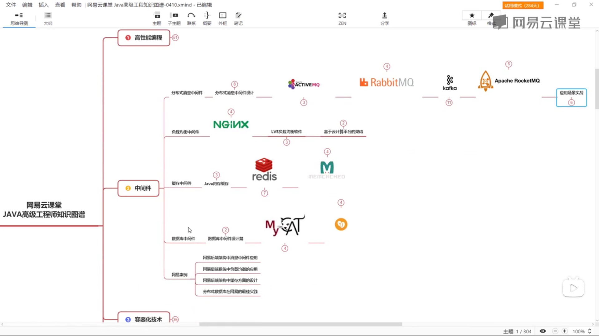
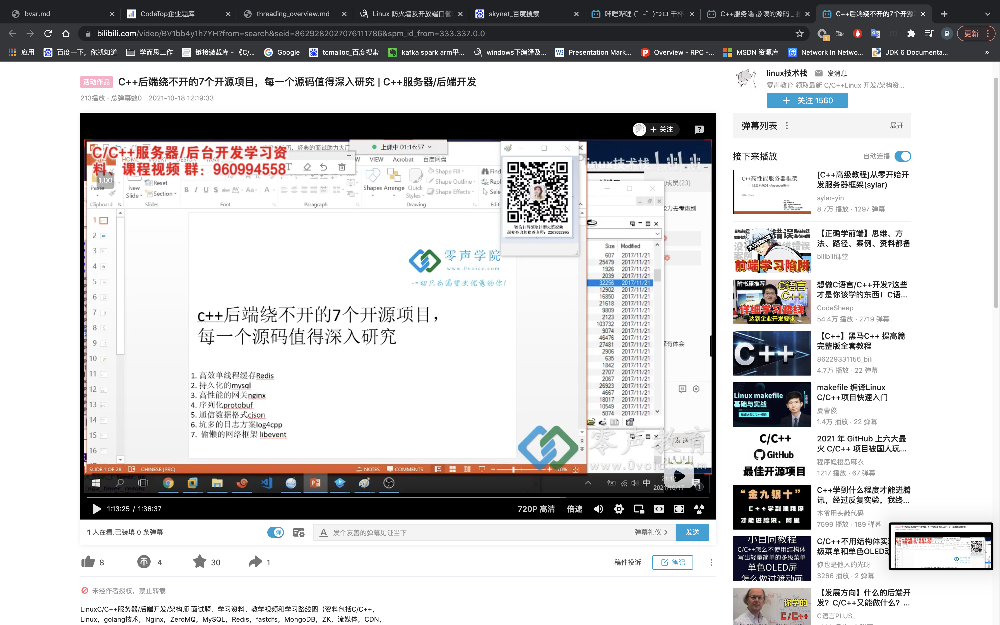

#### 先列一下目前我能想到的：
1. c++语言，面向对象, stl库等 
2. linux操作系统，各种调试器（如gdb）和编译器工具（makefile，gradle） 
3. 常用数据结构（表、树、图等）与算法（查找、排序、动态规划、最优路径等） 
4. 设计模式(23种，常用的如单例、工厂、命令、访问者等) 
5. 多进程、多线程与并发处理 
6. 网络编程(包括socket，i/o模型，多线程 多进程等) 
7. 关系型数据库(mysql等) 
8. 常用的开源服务器(nginx, redis等)，熟悉源代码，能做定制开发 
9. 掌握一门或多门脚本语言(shell, python) 
10. 常见网络协议(tcp/ udp，http,音视频相关rtsp,rtp.rtcp, rtmp等) 
11. 容器技术(Docker等) 
12. 云原生 
13. elasticsearch

#### 作者：阿里巴巴淘系技术链接：https://www.zhihu.com/question/19730582/answer/1663627873来源：知乎著作权归作者所有。商业转载请联系作者获得授权，非商业转载请注明出处。
中间件分类
什么时候使用中间件
基于中间件的定义我们知道中间件是连接软件与系统之间的服务，那么我们什么时候使用了中间件，在哪些地方用到了中间件了。我们不妨假设一个http请求过程来窥视一番。
当你在浏览器中输入一个网址时，它会通过 DNS 解析到目标服务注册的公网IP地址
请求到达目标服务的 web 反向代理服务器 Tengine 之后，经过一定的过滤转发到目标服务A上
服务A通过 RPC框架 Dubbo 请求服务B的结果做中间计算，并且从 Tair 缓存中读取计算因子，计算结果
服务A接着使用 Druid 通过 TDDL 写入计算结果到 MySQL Master 节点然后返回结果
异步过程中 Canal 通过模拟 Binlog 主从复制的原理，迅速将这条 Binlog 消费并下发到消息队列 RocketMQ
服务C通过 RocketMQ 消费到事件之后，通过配置中心 ConfigServer 拉取到的策略进行对应策略的事件处理。
这个过程中我们使用了一系列的中间件来协同各个微服务完成整个流程，如web反向代理服务器 Tengine、RPC框架 Dubbo、缓存 Tair、连接池 Driud、数据库代理层 TDDL、Binlog 同步工具 Canal、消息队列 RocketMQ、配置中心 ConfigServer。

常用基础中间件
- 路由与web服务器：处理和转发其他服务器通信数据的服务器。 如被业界广泛使用的阿里基于 Nginx 研发的 Tengine、阿里内部的集中式路由服务 VipServer
- RPC框架：微服务时代的远程服务调用框架。如grpc, Thrift, 阿里的 HSF, Dubbo, SOFA-RPC
- 消息中间件：支持在分布式系统之间发送和接收消息的软件。 如 Apache kafka, Apache RabbitMQ, NSQ, 阿里孵化开源的 Apache RocketMQ
- 缓存服务: 分布式的高速数据存储层，一般是内存存储。如 阿里 Tair，业界的 Redis, Memcached, Ehcache
- 配置中心：用来统一管理各个项目中所有配置的系统。如 阿里 Nacos、携程 Apollo、百度 Disconf
- 分布式事务：事务的参与者、支持事务的服务器、资源服务器以及事务管理器分别位于不同的分布式系统的不同节点之上。 如 阿里 seata、腾讯 DTF
- 任务调度：分布式环境下提供定时、任务编排、分布式跑批等功能的系统。如 阿里 SchedulerX、业界 xxl-job、当当 elastic-job、有赞 TSP
- 数据库层 用于支持弹性扩容和分库分表的 TDDL，数据库连接池 Driud, Binlog 同步的 Canal 等。
---

#### 源码学习

Redis

Zeromq
Ngnix

Libevent
Log4cpp
protobuf
Linux 
Chromium
cjson

Skynet
mysql

#### 知乎收藏
面试服务器开发方向 C++ 实习生时，大致会被问到哪些问题？
<b>bRpc:<b>https://www.zhihu.com/question/27840814
https://www.zhihu.com/collection/690623414
https://www.zhihu.com/collection/180282695

C++方向：
音视频，ai底层，高性能存储（这个go也在蚕食），游戏引擎

stackoverflow书单：
https://stackoverflow.com/questions/388242/the-definitive-c-book-guide-and-list/388282#388282