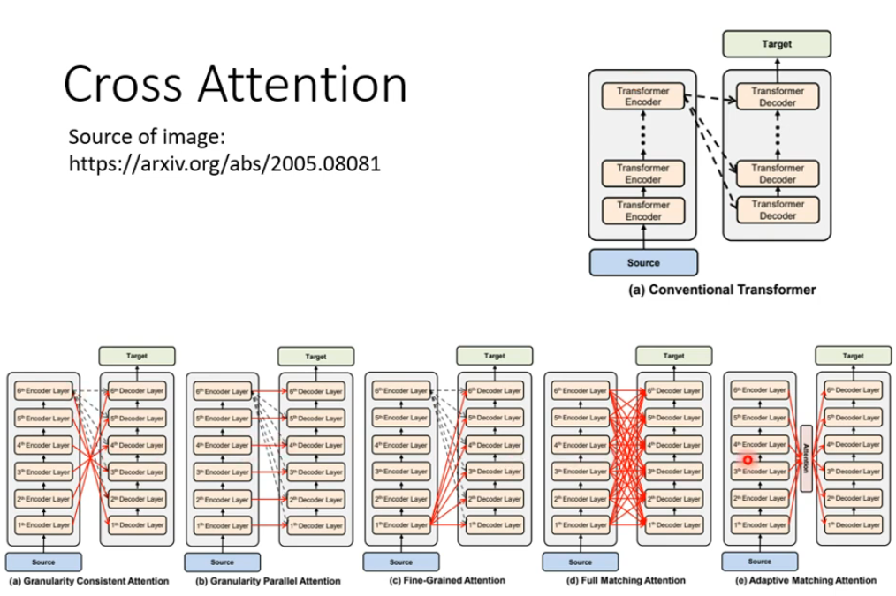

### Transformer是一个Seq2seq问题
应用有语音辨识 
音标->音频是一个Seq2seq问题 
question answering
语音对话机器人 
##  总览

## encoder

第一张图是做分类，所以输出一个。 
实际上encoder是输入一个vector sequence 输出一个vector sequence
## decoder
接受encoder，decoder 

decoder与encoder的区别： 
1、a1,a2,a3,a4只能顺序关联，例如：a2只能考虑a1 
2、输入和输出维度不同。输入有begin，输出需要自己决定输出维度，通过输出一个特殊的token--end 
AT vs NAT（AT是autoregressive） 

对比：1、NAT比AT快。2、容易控制输出长度3、但是NAT效果不如AT好 
### encoder 和 decoder怎么传递资讯
q来自于Decoder，k和v来自于encoderz，这个过程叫做cross attention。

原论文每层decoder都是拿encoder最后一层做输入，不一定这么做。 

## 训练
对于翻译问题，类似分类问题，输出vector sequence和希望的vector sequence的差距越小越好 
问题：训练的时候输入的是正确答案，teahcer forcing，mismatch：噪声，人为制造错误 
训练使用cross entropy：交叉熵
评估使用BLEU score :与人工翻译的几个句子做比较 
BLEUscore无法微分怎么解决：use reinforcement learning ：强化学习（比较困难不推荐）  
训练和测试是不一致的，exposure bias。 
故意假如一些错误数据，scheduled sampling 但是会损害一些平行话的能力 
对话问题：char—bot，**copy mechanism**。
需要从问题里面复制部分内容。 
还有提取摘要的问题。 
解决 **copy mechanism**使用pointer network。 
**guided attention** 
解决例如语音生成中的问题 
功能要求必须从左向右。 
**beam search** 
杂讯，随机性