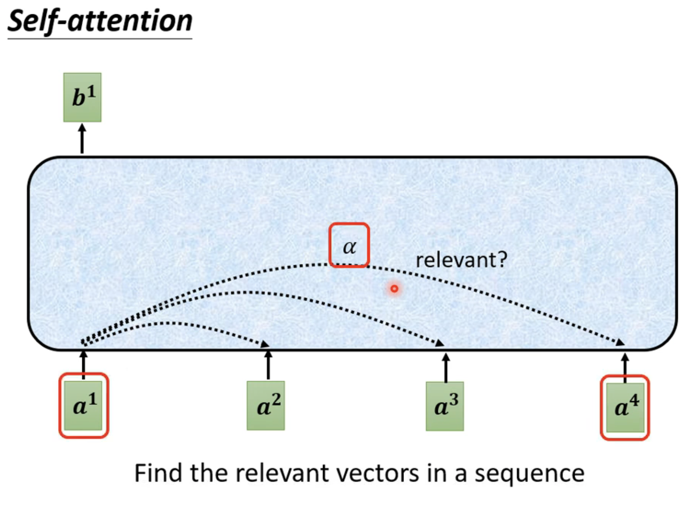
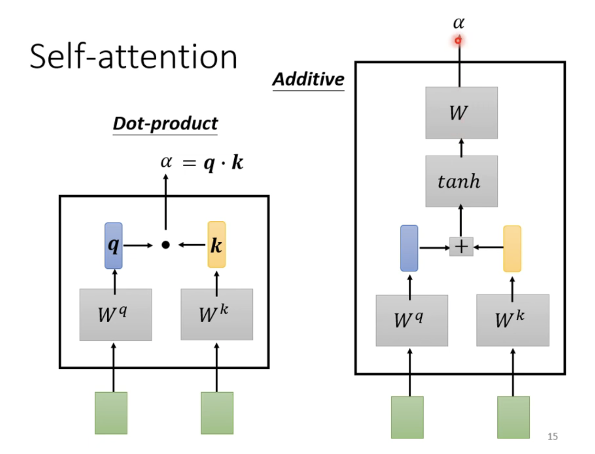
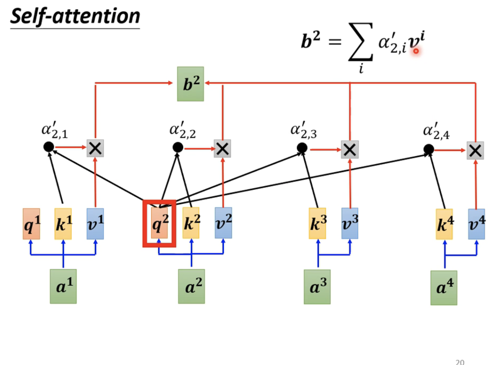

## 为什么需要？ 
ANN与之前的CNN输入都是一个向量，如果输入是多个向量怎么办？ 
## 输入
一句话、声音、Graph（社交网络关系、分子式）
## 输出
1、输入和输出长度相同。 
POS tagging， 词性标注，标注一个句子里面每个单词是动词、名词、形容词 
每个人是否会买一件商品
2、多个vecotr输出一个label 
判断一句话是正面还是负面 
判断是谁讲的
 
判断一个分子亲水性 
3、不知道输出多少个label，机器自己决定。 
翻译一句话 
语音辨识， 
## Sequence labeling
问题：翻译-- I saw a saw。 
我看见一个锯子。 
老的方案：一整个句子都输入到神经网络里面。 
缺陷：句子有长有短，参数多，训练量大、overfiting 
交互使用fc和
self-attention。google的Transformer 

怎么求相关度α 
Dot-product:使用较多a*b=|a||b|cos θ 
additive: 

### 原理：
 Q = W$^q$a$^1$a$^2$a$^3$a$^4$ 
 K = W$^k$a$^1$a$^2$a$^3$a$^4$ 
 V = W$^v$a$^1$a$^2$a$^3$a$^4$ 
  $[α^1α^2α^3α^4]^T$= $[k^1k^2k^3k^4]^Tq^1$ 
  位置资讯：在每个$a^i$上加上一个$e^i$,$e^i表示了位置