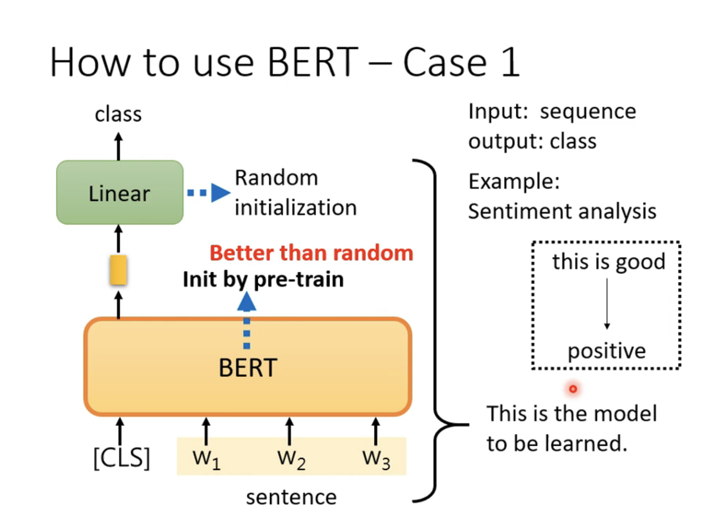
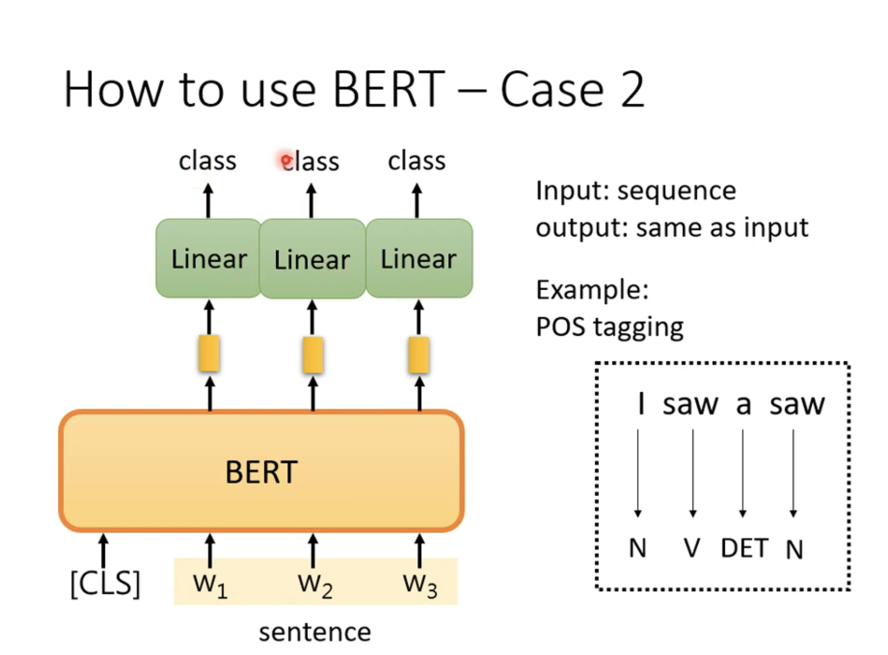

transformer 
盖住一个token 
“台湾大学” 盖住湾
分类问题，类别与中文字的数目相同，学习到被盖住的地方类别为’湾‘ 
### next sentence prediction
预测两个句子是否接在一起 
输入【cls】w1 w2 【w3 w4 w5】 
只取【cls】
没有什么用 
原因：可能问题太简单了 
总结：bert做了什么？ 
1、填空题 
2、预测两个句子是否接在一起 
实际做了什么？
Downstream tasks（下游任务）==》通过pre——train 
bert可以做很多意想之外的问题。 
# 有：
GLUE（自然语言数据集）包含的9个任务： 
怎么用？ 
case 1： 
一个句子是正面/负面？ 
初始化，使用填空题的bert初始化参数。 
pre-train v.s. random initilization 

case 2: 
怎么用bert解决’i saw a saw‘问题，词性分析？ 

仍然需要一些资料，有标注，区别就是使用bert初始化参数。 
case 3： 
输入两个句子，输出一个类别 
narural language infrerencee（nli） 
case 4： 
作业。。。 
简单的问答系统，答案就在文章里面 
训练bert：3billion个参数，无法自己训练 

## GPT模型
预测下一个出现的词 
不需要样例。 
类似few-shot learning ， in-context learning 
例子： 
翻译中文为英文： 
他=》he，攻击=》fight 
准确率平均“50%”多。 

