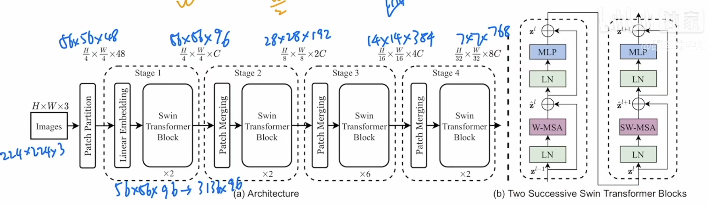
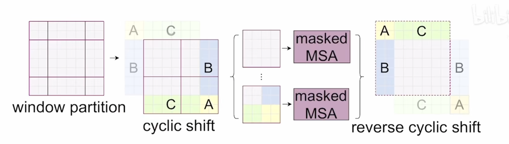
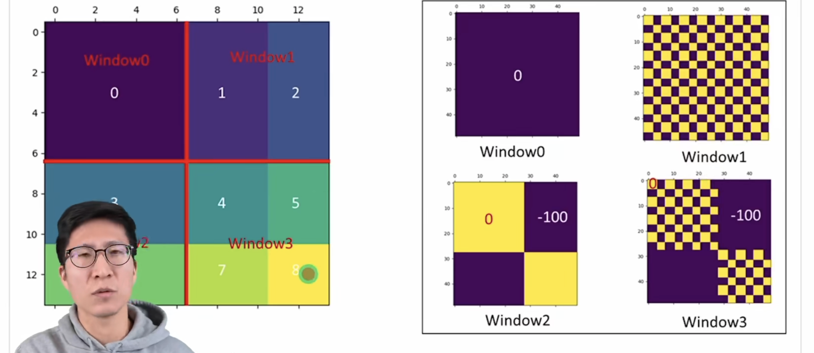

对比vit 
传统vit感受野一直为16，不能做密集型的预测任务 
swin 使用卷积和vit结合，patch merge操作  shift window 技术。 
cross window connection 
计算复杂度，线性增长 
forward操作，
224x224x3 
56x56x48 
linear embedding 3136x96 
3136太长？ 
基于窗口的自注意力，swin transformer block 
**patch merging**隔一个点去一个点 
HxWxC => H/2xW/2x4C,类似池化操作 
减少C的数目，使用1x1的卷积操作H/2xW/2x2C 
到这的整个过程叫做patch merging 
再来一遍 28x28x192 
14x14x384 
7x7x768 
vit有一个cls的token，swin没有 
1x768 => 1x1000 

###3.2
最小的计算单元7x7的patch 
基于窗口的自注意力vs全局的自注意力，时间复杂度？ 
传统$3hwc^2 + 2(hw)^2 + hwc^2$ 
本论文hw变成了MxM, 带入到上式子 
一共有$hw/m^2$个窗口，再乘以这个数，得到结果为$4hwC^2 + 2M^2hwC$ 
复杂度下降几十上百倍。 
问题：窗口之间缺少通信？ 
解决：按照上文的shift window算法 

### shift window
怎么做  
mask移位 

问题：移位后，无关的patch挨着了 
解决：通过mask解决 
#### mask操作
1、先拉直 
2、直接做自注意力计算，不同的直接去掉。方法：使用掩码模板和结果相加，不要的变为负数，经过softmax变为零 

