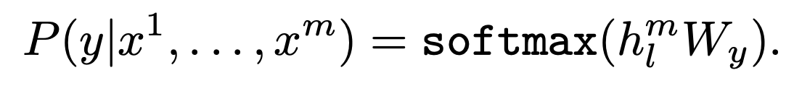
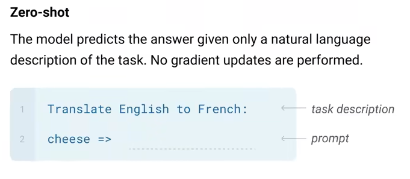
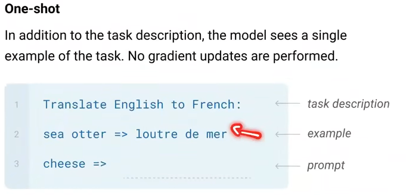
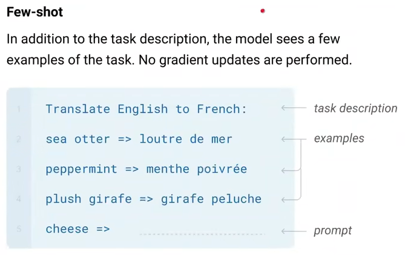

### GPT
在未标注数据上的学习这一部分，需要学习一个语言模型，所谓的语言模型，就是依据前面的context，去预测下一个词。如下面的公式所示。

在得到了基于Transformer的模型之后，针对具体的某个任务，假设输入和输出分别是x和y，那么我们在transformer的输出上再加一层：

从而得到新的损失函数：

l1 没有标号  
l2 有标号

注意下游任务，添加了开始符，分隔符，结束符
### GPT-2
1.5biliion参数  
#### zero-shot 
​ GPT2中使用了多任务学习，把多个相关的任务放在一起学习，同时学习多个任务。  
通过多个相关任务同时并行学习，梯度同时反向传播，多个任务通过底层的共享表示、互相补充学习到的领域相关的信息，互相帮助学习任务，从而提升泛化效果。  
Zero-shot的概念：以往比较常规的思路是在一个很小的语料库训练一个语言模型然后再接上特定的任务进行微调。而零次学习指的是用很大的语料训练一个模型，在训练的时候就直接接上很多的下游任务。然后在做具体的任务时，并不需要进行训练，直接放入我们的模型，其效果还能超过其他模型在小数据上的效果。

下游任务不需要有标号
有效性不好
### GPT-3
解决的难题：  
1、大数据集问题标号难
2、当一个样本没有出现在训练数据集中，表现不好。过拟合问题。
3、人类不需要特别大的数据集来做任务。
“meta-learning”:大量样本，上下文学习
（a）使用few-shot（少量标号样本10-100个样本），不更新权重  
（b）one-shot learning:一个样本
（c）zero-shor:没有样本

上下文的学习

