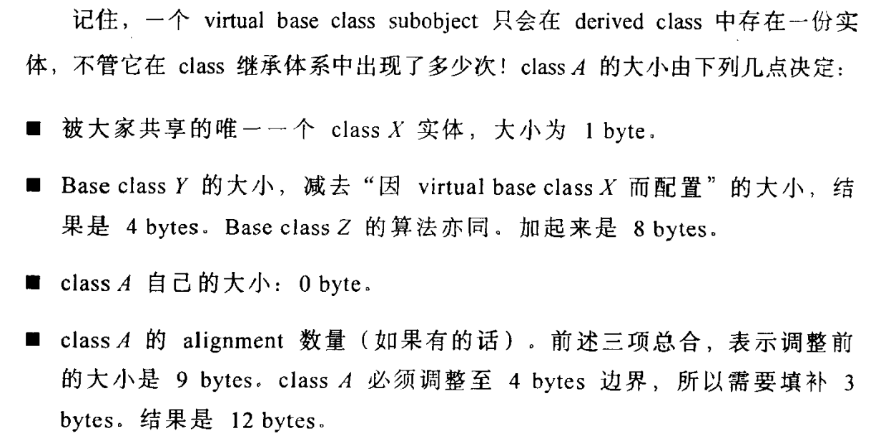

```
class X {};
class Y : public virtual X {};
class Z : public virtual X {};
class A : public Y, public Z {};
//sizeof的结果
//1
//8
//8
//12
```

编译器可能会优化掉class X的大小1byte。
### 3.1 Data Member的绑定（The Binding of a Data Member） 
typedef 要在成员变量前，  定义不用（例如：函数前定义一个全局变量x，类结束位置定义一个成员变量x，类内部访问的x是成员变量x）；
### 3.2 Data Member的布局（Data Member Layout） 
### 3.3 Data Member的存取 
```
Point3d origin;
origin.x = 0.0;
// 如果是指针，又没有差异
```
x的存取成本，可能的影响因素：是否是static，x是class吗，是多重继承的class吗，指针跟值得区别。

origin->x 是一个虚基类成员变量时，运行期才能通过一个间接引导拿到，其他情况与普通取值没有区别。
### 3.4 "继承"与Data Member
1、继承，子类和父类间，内存对齐不会相互填补。
```
& Point3d::z; //得到z坐标在 class object中的偏移量(offset)
```
书中说的,&Point3d:: z 会比 &origin.z大1的情况不准确。依赖于编译器的实现。