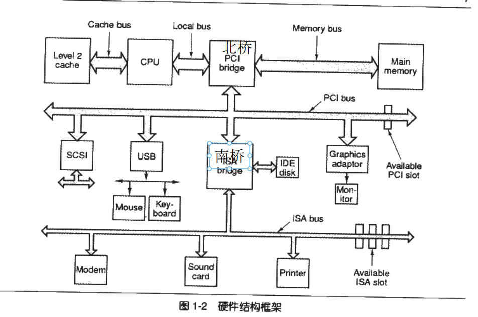

### 1.2硬件架构图

### 1.5 内存分页
虚拟页映射到屋里页 
虚拟页：部分常用页面映射到内存，部分不常用映射到磁盘，部分未使用不映射 
页错误/缺页异常：访问没有映射的虚拟页。 
 
一个进程启动了很久，但是长时间没有活动。若是计算机处在很高的内存压力下，则操作系统会将这一进程长期未使用的页帧内容，从物理内存转储到磁盘上。这个过程称为换出（swap out）。在 linix 系统下，用于转储这部分内存内容的磁盘空间，称为交换空间；在 Windows 上，这部分磁盘空间，则被称为虚拟内存，对应磁盘上的文件则称为页面文件。在这个过程中，进程在内存中保存的任意内容，都可能被换出到交换空间：可以是数据内容，也可以是进程的代码段内容。 
软缺页：软性页缺失指页缺失发生时，相关的页已经被加载进内存，但是没有向MMU注册的情况。 
硬缺页:硬性页缺失是指相关的页在页缺失发生时未被加载进内存的情况。 
### 1.6
优先级和轮转法： 
每个线程一个时间片，优先级高的先执行。 
防止饿死：一个线程等待时间长了，提高优先级。 
其他方法：多级分发，每种优先级一个队列，高优先级队列时间片更多。 
线程同步：互斥量、临界区、读写锁、条件变量 
violate:防止编译器为了提高速度将一个变量缓存到寄存器而不写回 
内存屏障 
用户线程：切换由用户态程序自己控制，各个用户线程只能在进程内进行资源竞争。 
内核线程：内核线程又称为守护进程，内核线程的调度由内核负责，一个内核线程处于阻塞状态时不影响其他的内核线程，因为其是调度的基本单位。 
线程模型：一对一（createThread）、多对一（协程）、多对多（bthread） 
