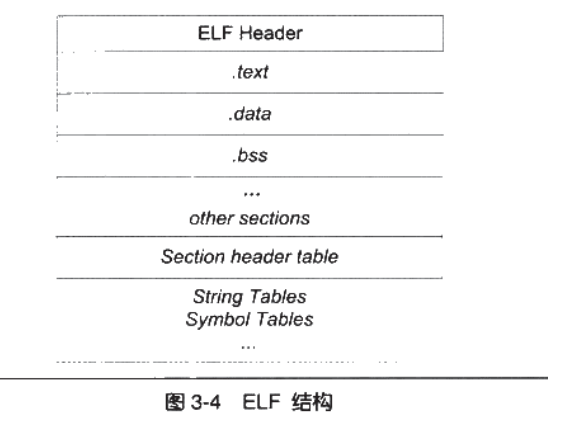

### 3.1 目标文件的格式
windwos下的PE、Linux下的ELF，都是COFF格式的变种<br/>
可执行文件、动态链接库（dll，.so）、静态链接库（lib，.a）、目标文件(.o,,obj)、core dump文件共五种都是PE/ELF格式。<br/>
静态链接库稍有不同，它是把许多目标文件捆绑在一起形成一个文件。<br/>
### 3.4

ELF Header ===> 段表Section header table<br/>
### 3.5 链接的接口--符号
符号表--符号值  对于函数和变量来说符号值就是他们的地址<br/>
符号分类：<br/>
定义在本目标文件的全局符号，本目标文件中引用的全局符号，段名，局部符号（static_var、static_var2，用于分析核心转储文件），行号信息<br/>
符号表事文件中的一个段，段名一般叫做“.symtab”<br/>
#### 3.5.3
函数签名_ZN1N1C4FUNCEi   <===>   N::C::func(int)<br/>
统一以_Z开头，对于嵌套的名字（在名称空间或者类里面），后面紧跟N，然后事各个名称空间和类的名字，每个名字前事名字字符串长度，再以“E”结尾，参数列表紧跟再E的后面，对于int类型来说就是i。
#### 3.5.4
声明一个C语言函数，在C编译器和C++编译器下运行都正常。
```
#ifdef __cplusplus
extern "C" {
#endif
void *memset(void *, int, size_t);
#ifdef __cplusplus
}
#endif
```
#### 3.5.5 强符号与弱符号
```
extern int ext; //外部变量引用，不是强符号也不是弱符号

int weak; //弱符号，未初始化的全局变量
int strong = 1; //强符号，初始化的全局变量
__attribute__((weak)) int weak2 = 2;  //弱符号，手动指定
//main函数强符号，编译器认为函数是强符号
int main() {
    return 0;
}
```
规则1：不允许强符号多次被定义<br/>
规则2：如果一个符号在某个目标文件中是强符号，在其他文件中都是弱符号，编译器选择强符号<br/>
规则3：如果一个符号在所有文件中都是弱符号，选择占用空间最大的一个<br/>
#### 弱引用和强引用
```
__attribute__((weakref)) void foo();
int main()
{
    //if(foo) //改进
    foo();;
}
```
上面的函数foo如果没有定义也可以编译通过，但运行时发生错误。<br/>

强弱符号，引用的作用：<br/>
1、库中定义弱符号，用户定义强符号，实现自定义版本的库函数<br/>
2、扩展功能定义为弱引用，可以编译正常，只是缺少了相应的功能。<br/>
