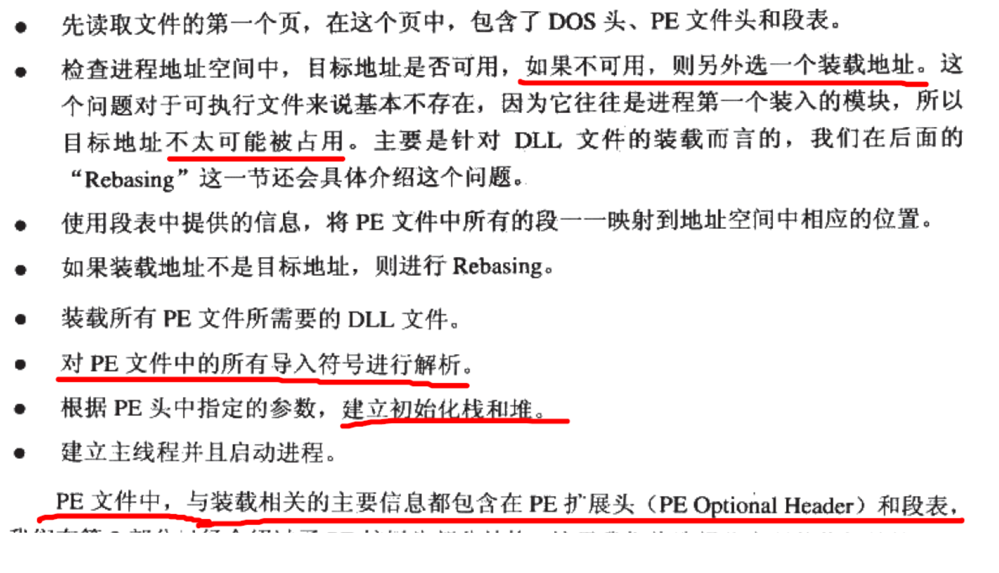

### 6.1
共4g虚拟地址空间  linux系统占1G windows系统占2g（可以修改配置文件，使windows系统占1g） 
PAE 
32位CPU使用的空间能否超过“4gb”，虚拟地址空间不可以，计算机的内存可以。使用PAE技术。
### 6.2装载的方式
覆盖装入（淘汰）、页映射 
### 6.3 从操作系统角度看可执行文件的装载
1、创建一个独立的虚拟空间--虚拟空间和物理内存之间的映射关系。 
实际上只是分配了一个页目录，后面程序发生页错误的时候再进行设置。 
2、读取可执行文件头，并建立虚拟空间与可执行文件的映射关系--虚拟空间与可执行文件之间的映射关系。  
3、将CPU的指令寄存器设置成可执行文件的入口地址 
### 6.4 进程虚存空间分布
#### 6.4.1
对于ELF（linux）段比较多 
程序主要关心段的权限（可读、可写、可执行） 
段的权限组合有三种： 
·以代码段为代表的刻度可执行段 
·以数据段和bss段为代表的可读可写段 
· 以只读数据段为代表的只读的段 
ELF引入一个概念叫做Segment。从程序装载的角度重新划分了所有段。信息放在表头的一个专门的数据结构中 
从连接角度看叫section，从装载角度看交segment。 
#### 6.4.2
VMA除了被用来映射Segment外，堆栈在进程的虚拟空间中的表现也是以VMA的形式存在的。

VMA区域类型划分： 

#### 6.4.3
堆的最大申请数量：linux2.9g，windows1.5g 
每次大小固定，版本、动态库数量大小等等；随机地址空间分布，防止程序恶意攻击。
#### 6.4.4
页是最小的映射单位，4096字节。 
防止浪费，各个段接壤部分，共享一个物理页面，改物理页面被分别映射两次。 
#### 6.4.5进程栈初始化
静态链接，进程开始时才，需要知道一些进程运行的环境，最基本的就是系统环境变量和进程的运行参数。很常见的一种做法是操作系统在进程启动前，将这些信息提前保存到进程的虚拟空间的栈中 
栈初始化，通过main函数参数argc和argv传入 
### linux装载elf

### windows装载PE

PE所有段起始都是页的倍数，可执行文件段比较少，链接器将所有的段尽量合并。 
