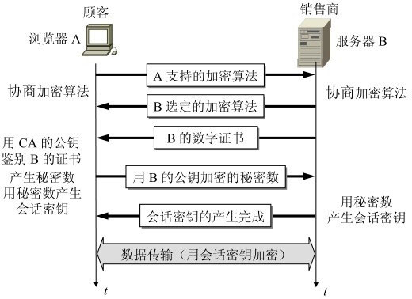
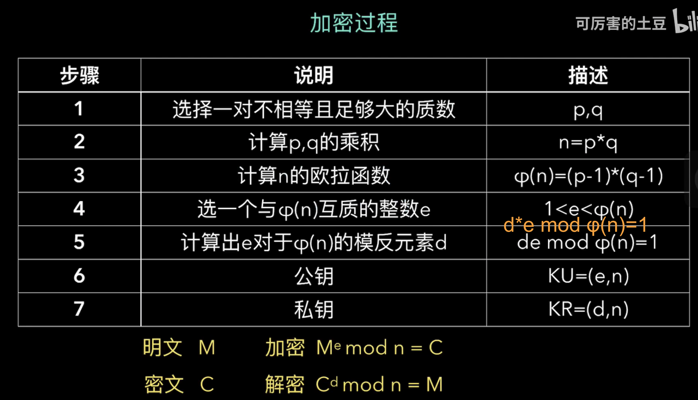

### HTTP报文

1、请求方法  
① GET:请求获取Request-URI(URI:通用资源标识符,URL是其子集，URI注重的是标识，而URL强调的是位置，可以将URL看成原始的URI),所标识的资源  
② POST：在Request-URI所标识的资源后附加新的数据；支持HTML表单提交，表单中有用户添入的数据，这些数据会发送到服务器端，由服务器存储至某位置（例如发送处理程序）请求参数放在请求体中
③ HEAD:请求Request-URI所标识的资源响应消息报头，HEAD方法可以在响应时不返回消息体。  
④ PUT：与GET相反，请求服务器存储一个资源，并用Request-URI做为其标识；例如发布系统。  
⑤ DELETE：请求删除URL指向的资源  
⑥ OPTIONS：请求查询服务器的性能，或者查询与资源相关的选项  
⑦ TRACE：跟踪请求要经过的防火墙、代理或网关等，主要用于测试或诊断  
⑧ CONNECT保留将来使用 
1）GET和POST两种基本请求方法的区别 
从语法上讲
① 最直观的区别就是GET把参数包含在URL中，POST通过request body传递参数。  
② GET发送一次数据，POST发送两次（浏览器支持）
从语义上讲
③ 私密性信息POST 请求信息GET
④ 幂等性  
GET的语义是请求获取指定的资源。GET方法是安全、幂等、可缓存的（除非有 Cache-ControlHeader的约束）,GET方法的报文主体没有任何语义。  
POST的语义是根据请求负荷（报文主体）对指定的资源做出处理，具体的处理方式视资源类型而不同。POST不安全，不幂等，（大部分实现）不可缓存。  
2、网址。一个完整的包括类型、主机名和可选路径名的统一资源引用名  
3、
4、首部分为：通用首部，请求首部，响应首部，实体首部，扩展首部
cookie、重定向地址、connection（是否持久）
5、域值
connection的阈值为keep-alive
6、
7、

1、
2、  
1xx:post第一次返回100
2xx:成功
3xx:客户端需要进一步操作，如重定向
4xx:客户端类错误
5xx：服务端类错误
3、
200：OK
404：NOT FOUND
。。。
4、首部和阈值  
Date：消息产生时间
。。。
5、响应报文
### HTTP 特点
HTTP 协议一共有五大特点：a. 支持客户/服务器模式；b. 简单快速；c. 灵活；d. 无连接；e. 无状态。  
无连接：一次处理一个请求，受到应答。即断开链接。keep-alive可以保持。  
无状态：交互场景没有记忆能力。cookie客户端信息，session服务端查表，确定状态。

http和https区别：
1、https需要CA申请证书  
2、http明文传输，https加密传输协议
3、端口不一样http80  https443
4、https ssl身份认证，加密传输,ssl是有状态的，http无状态。

非对称加密和对称加密混合
非对称加密（只用于证书验证阶段，交换秘钥）：  
RSA算法：

对称加密：使用非对称加密交换的秘钥加密。  
### http各版本的区别
http1.0和1.1的区别：
1）持久连接，多个http请求使用同一个tcp连接，减少了tcp建立连接时的开销

（2）客户端和服务器之间可以建立多个tcp连接以解决队头阻塞的问题

（3）响应体可以分块传输，无需一次传输全部内容

（4）响应头增加content-length字段满足动态内容无法一次计算出长度和无法一次传输完成的问题

（5）增加了安全机制和cookie机制
http1.1和2.0的区别：  
1、使用了多路复用技术，同一个连接并发处理多个请求。  
2、http1.1只有消息主体压缩，2.0增加了头部压缩技术
3、服务端推送
http3.0 开始使用udp协议

#### http缓存：
分为两大类：强制缓存和协商缓存  
强制缓存--过期时间
协商缓存--客户端发给服务端资源id，服务端对比是否变化。返回304表示没过期。
#### http长连接和短连接：
长连接优点：可以节省较多的TCP连接和释放的操作，节约时间，对于频繁请求资源的用户来说，适合长连接。

长连接缺点：由于有保活功能，当遇到大量的恶意连接时，服务器的压力会越来越大。这时服务器需要采取一些策略，关闭一些长时间没有进行读写事件的的连接。

短连接优点：短连接对服务器来说管理比较简单，只要存在的连接都是有效连接，不需要额外的控制手段，而且不会长时间占用资源 。

短连接缺点：如果客户端请求频繁的话，会在TCP的建立和释放上浪费大量的时间。

>注意：从HTTP/1.1版本起，默认使用长连接用以保持连接特性。使用长连接的HTTP协议，会在响应消息报文段加入: Connection: keep-alive。TCP中也有keep alive，但是TCP中的keep alive只是探测TCP连接是否活着，而HTTP中的keep-alive是让一个TCP连接获得更久一点。