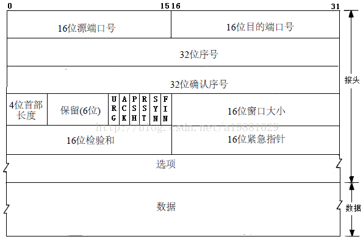
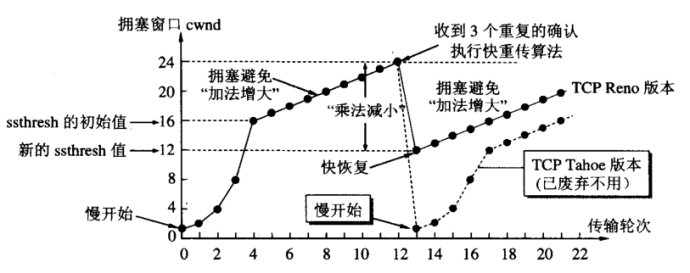
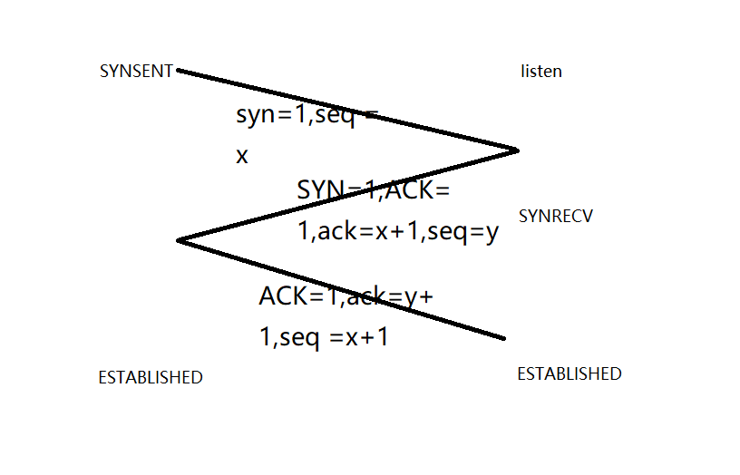
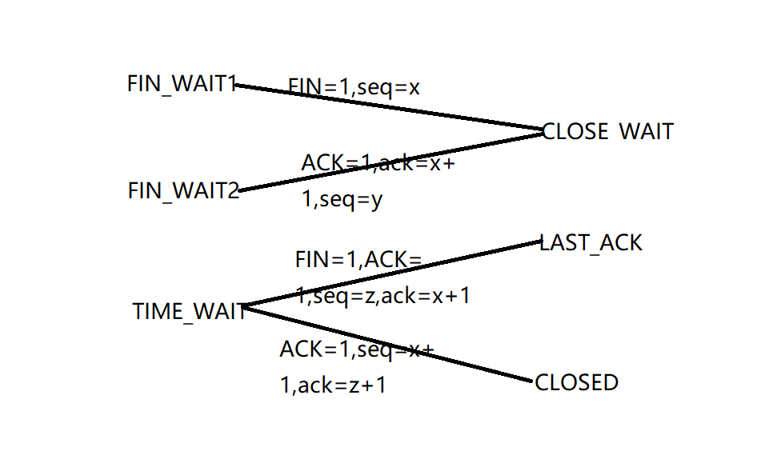

## IP
### 报文结构

1、版本ipv4  
2、固定部分（20字节）和可变部分之和  
3、服务类型：网络控制、疾速、优先、普通。。  
4、首部和数据部分长度之和  
5、每一份数据的标识。ip报文长度大于传输网络的MTU时，必须分片，这个数据被复制到所有分片中。  
6、共3位。R、DF、MF三位。目前只有后两位有效，DF位：为1表示不分片，为0表示分片。MF：为1表示“更多的片”，为0表示这是最后一片。  
7、本分片在原先数据报文中相对于首位的偏移。  
8、允许通过的最大路由器数量，防止回环  
9、上层协议:tcp、udp、ICMP  
10、校验ip包头的完整性  
11、  
12、  
## TCP
### 报文结构

tcp包头最小为20字节；tcp包最大为1480字节  
1、  
2、  
3、在TCP传送的流中，每一个字节一个序号。一个报文段的序号为300，此报文段数据部分共有100字节，则下一个报文段的序号为400。所以序号确保了TCP传输的有序性。  
4、确认号，即ACK，指明下一个期待收到的字节序号，表明该序号之前的所有数据已经正确无误的收到。确认号只有当ACK标志为1时才有效。比如建立连接时，SYN报文的ACK标志位为0。  
5、tcp包头的长度  
6、  
7、URG  ACK  PSH  RST  SYN  FIN，共6个，每一个标志位表示一个控制功能
> 1）URG：紧急指针标志，为1时表示紧急指针有效，为0则忽略紧急指针。
   
2）ACK：确认序号标志，为1时表示确认号有效，为0表示报文中不含确认信息，忽略确认号字段。  

3）PSH：push标志，为1表示是带有push标志的数据，指示接收方在接收到该报文段以后，应尽快将这个报文段交给应用程序，而不是在缓冲区排队。  
4）RST：重置连接标志，用于重置由于主机崩溃或其他原因而出现错误的连接。或者用于拒绝非法的报文段和拒绝连接请求。  
 
5）SYN：同步序号，用于建立连接过程，在连接请求中，SYN=1和ACK=0表示该数据段没有使用捎带的确认域，而连接应答捎带一个确认，即SYN=1和ACK=1。
  
6）FIN：finish标志，用于释放连接，为1时表示发送方已经没有数据发送了，即关闭本方数据流。

8、滑动窗口的大小，流量控制  
9、只有当 URG 标志置 1 时紧急指针才有效。
10、选项和填充：常见内容如MSS
11、数据部分  
### 可靠性
TCP协议保证数据传输可靠性的方式主要有：校验和、序列号、确认应答、超时重传、连接管理、流量控制、拥塞控制。  
流量控制：
滑动窗口，协商，客户端和服务端滑动窗口的最小值。
零窗口：计时器，周期性探查。
TCP 拥塞控制算法：
  
1.慢开始：初始拥塞窗口为1
2.拥塞避免：加法增大乘法减小
3.快重传：接收方收到失序报文，立马请求重传。
假如M2收到了，M3没有收到，之后的M4,M5,M6又发送了，此时接收方收到3个重复确认，立马重传M3。
4.快恢复：如果发送方收到了3个重复确认，就执行快恢复算法。将慢开始门限sstresh和拥塞窗口cwnd都设置为当前拥塞窗口的一半，然后执行拥塞避免算法
### TCP/IP关联与对比
MTU：链路层提供给ip层，缺省1500byte。  
MSS：由协商决定，受到MTU的限制。TCP提交给IP层最大分段大小，MTU=1500Byte - 20BYte(ip头长度) - 20Byte(tcp头长度)
### 三次握手，四次挥手

为什么需要三次：
若客户端向服务端发送的连接请求丢失，客户端等待应答超时后就会再次发送连接请求，此时，上一个连接请求就是『失效的』。  
两次握手：通信结束，收到一个失效连接请求，又建立了一个连接，但是客户端实际已经关闭，导致服务端一直等待。

为什么TIME_WAIT后要等2倍的msl，为了确保B收到最后一条ack。如果该应答丢失，B等待超时后就会重新发送连接释放请求，但此时A已经关闭了，不会作出任何响应，因此B永远无法正常关闭。  
大量FIN_WAIT2？？  
不发送LAST_ACK,永远处于半打开状态，设置一个超时时间。  
大量TIME_WAIT？？  
高并发，MSL过长

粘包：1、发送方原因，Nagle算法。2、接收方处理不及时，缓冲区。  
解决：1、发送方：关闭Nagle算法。2、接收方，应用层处理，①固定长度②报文中记录长度。  
udp：  
（1）提供超时重传，能避免数据报丢失。

（2）提供确认序列号，可以对数据报进行确认和排序。

### 异常处理
RST标志位  
1、被连接端，未监听请求端口  
2、第二次挥手后，网断了，客户端放弃这个链接后又收到数据包  
3、
